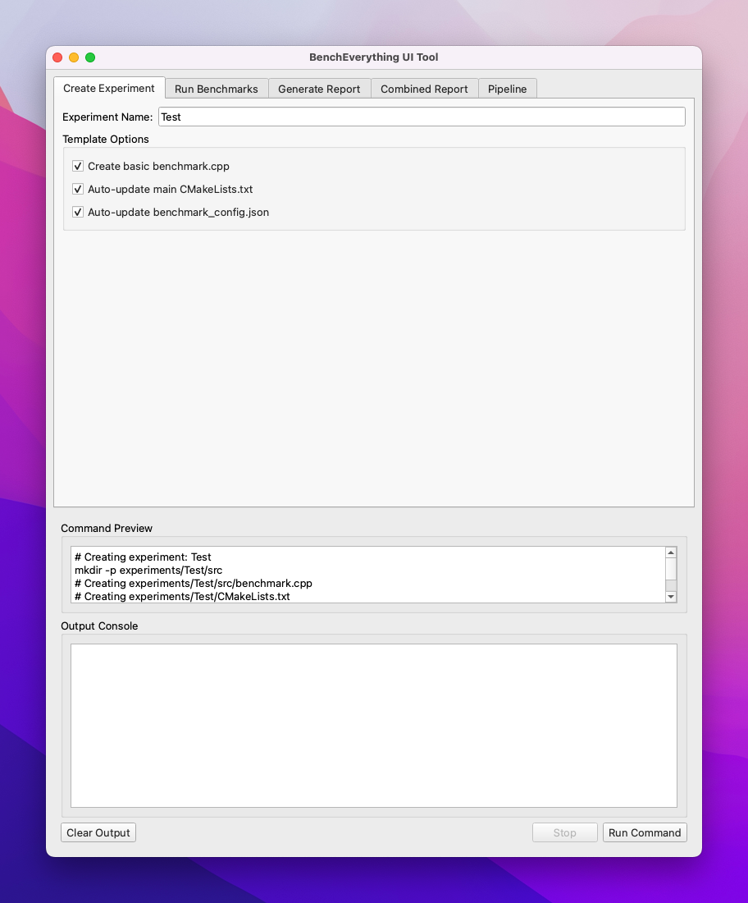
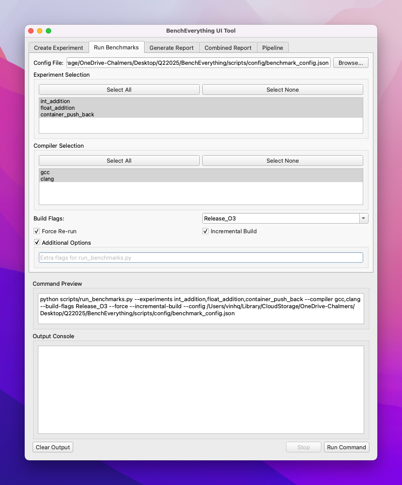
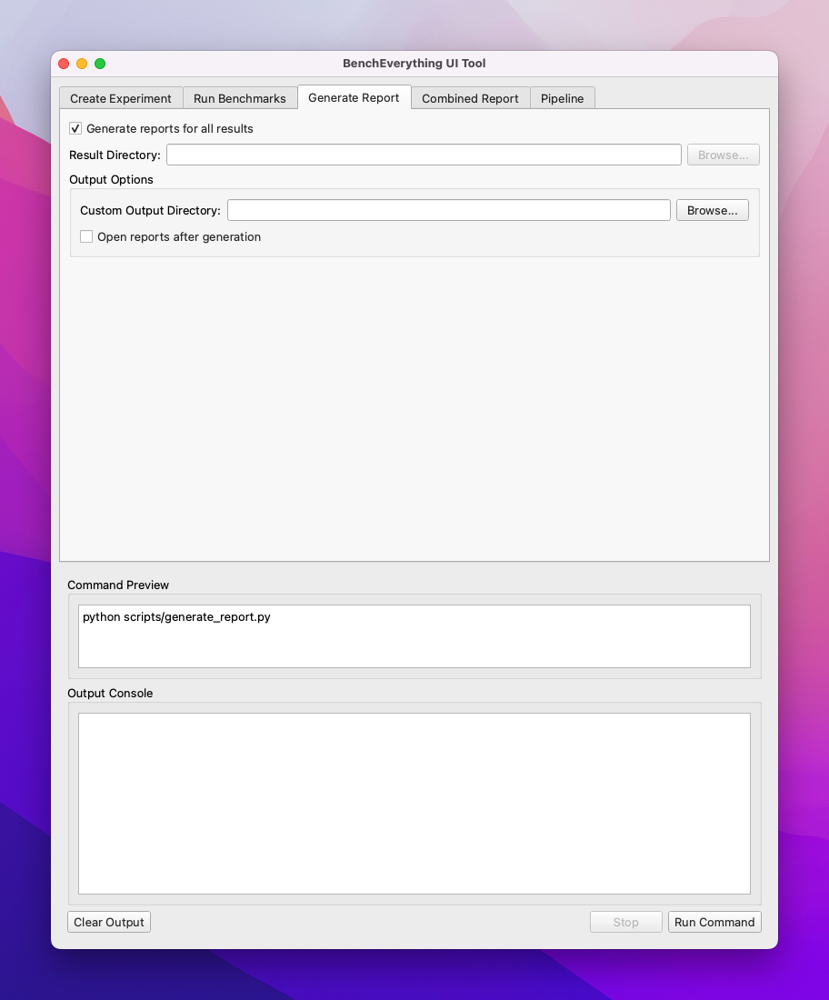
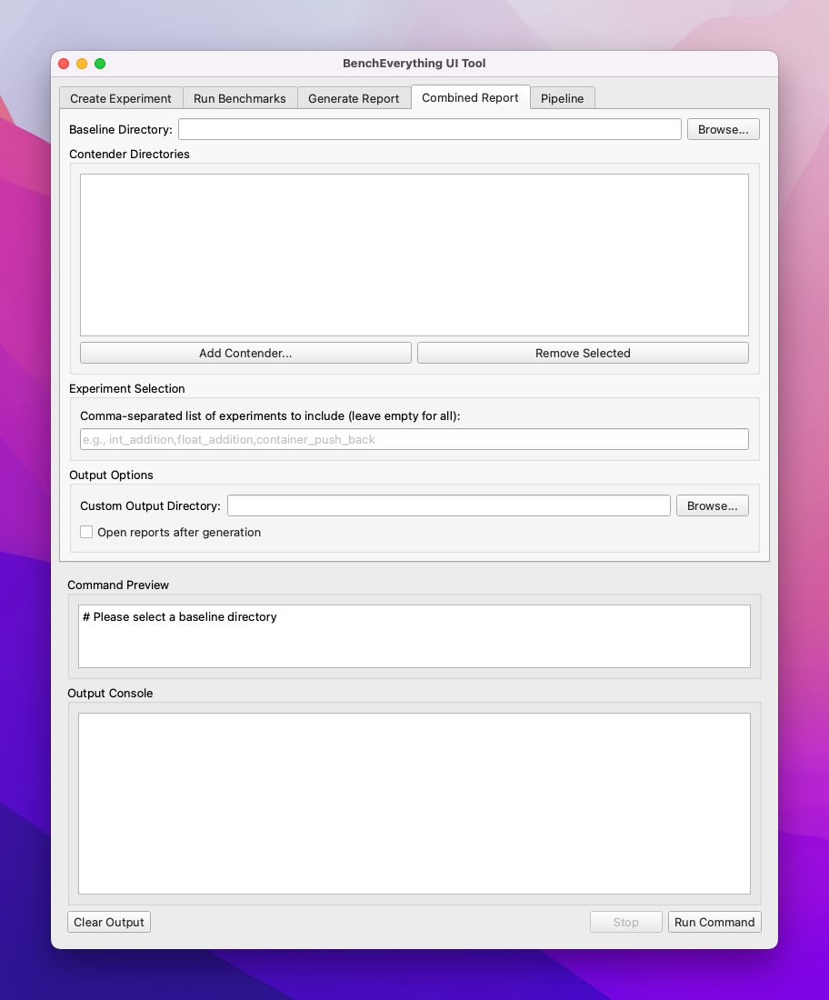

# BenchEverything Project Documentation

## Table of Contents

* [1. Introduction](#1-introduction)
   * [1.1. Goal](#11-goal)
   * [1.2. Core Philosophy](#12-core-philosophy)
* [2. Core Concepts](#2-core-concepts)
* [3. Directory Structure](#3-directory-structure)
* [4. Quickstart Guide](#4-quickstart-guide)
   * [4.1. Prerequisites](#41-prerequisites)
   * [4.2. Running Existing Benchmarks](#42-running-existing-benchmarks)
   * [4.3. Creating a New Benchmark](#43-creating-a-new-benchmark)
   * [4.4. Generating Reports](#44-generating-reports)
   * [4.5. Cross-Machine Workflow](#45-cross-machine-workflow)
   * [4.6. Using the UI Tool](#46-using-the-ui-tool)
* [5. Creating and Managing Experiments](#5-creating-and-managing-experiments)
   * [5.1. Experiment Structure](#51-experiment-structure)
   * [5.2. Writing Benchmark Code](#52-writing-benchmark-code)
   * [5.3. CMake Integration](#53-cmake-integration)
   * [5.4. Experiment-Specific Configuration](#54-experiment-specific-configuration)
   * [5.5. Pre-Report Scripts](#55-pre-report-scripts)
* [6. Running Benchmarks (`run_benchmarks.py`)](#6-running-benchmarks-run_benchmarkspy)
   * [6.1. Command-Line Options](#61-command-line-options)
   * [6.2. Configuration File (`benchmark_config.json`)](#62-configuration-file-benchmark_configjson)
   * [6.3. Build Management](#63-build-management)
   * [6.4. Toolchain Files](#64-toolchain-files)
   * [6.5. Data Collection](#65-data-collection)
   * [6.6. Result Directory Structure](#66-result-directory-structure)
* [7. Generating Reports](#7-generating-reports)
   * [7.1. Single Report Generation (`generate_report.py`)](#71-single-report-generation-generate_reportpy)
      * [7.1.1. Report Structure & Assets](#711-report-structure--assets)
      * [7.1.2. Template Placeholders](#712-template-placeholders)
      * [7.1.3. Pre-Report Script Integration](#713-pre-report-script-integration)
      * [7.1.4. Handling Failures](#714-handling-failures)
   * [7.2. Combined Report Generation (`generate_combined_report.py`)](#72-combined-report-generation-generate_combined_reportpy)
      * [7.2.1. Report Types](#721-report-types)
      * [7.2.2. Comparison Assets](#722-comparison-assets)
   * [7.3. Godbolt Integration](#73-godbolt-integration)
* [8. Extensibility Guide](#8-extensibility-guide)
   * [8.1. Adding a New Profiler](#81-adding-a-new-profiler)
   * [8.2. Adding Custom Analysis/Plots](#82-adding-custom-analysisplots)
   * [8.3. Supporting New Platforms](#83-supporting-new-platforms)
* [9. Future Considerations](#9-future-considerations)
   * [9.1. Godbolt Integration](#91-godbolt-integration)
   * [9.2. Planned Enhancements](#92-planned-enhancements)
   * [9.3. Contributing](#93-contributing)
* [Appendix A: Troubleshooting](#appendix-a-troubleshooting)

---

## 1. Introduction

### 1.1. Goal

BenchEverything automates C++ microbenchmarking tasks that developers typically need to perform repeatedly, providing a structured framework with:

1. **Standardized Benchmarking**: Run consistent benchmarks across different compilers, platforms, and configurations
2. **Comprehensive Data Collection**: Gather timings, performance counters, and assembly code in one place
3. **Automated Reporting**: Generate visual reports with minimal effort
4. **Cross-Configuration Comparison**: Easily compare performance across compilers, flags, and platforms

A core objective is also to help **demystify performance assumptions** that may no longer hold true on modern compilers and CPUs. By making it easy to test the same code across multiple configurations, BenchEverything helps reveal optimization behaviors that might be counter-intuitive or have changed over time.

### 1.2. Core Philosophy

*   **Experiment-centric:** Each benchmark lives in its own isolated directory under `experiments/`.
*   **Reproducibility:** Results are tagged with configuration details (platform, compiler, flags, CPU model) and a unique metadata hash that ensures reproducible identification of benchmark runs.
*   **Centralized Configuration:** A primary Python script (`scripts/run_benchmarks.py`), potentially driven by config files, acts as the main user interface for defining *what* to run and *how*.
*   **Extensibility:** The structure and scripts are designed to be easily modified to add new tools, metrics, platforms, or reporting formats.

---

## 2. Core Concepts

BenchEverything follows a 3-step workflow:

```
┌─────────────────┐      ┌─────────────────┐      ┌─────────────────┐
│  1. CREATE      │      │  2. RUN         │      │  3. REPORT      │
│  EXPERIMENT     │─────>│  BENCHMARKS     │─────>│  GENERATION     │
└─────────────────┘      └─────────────────┘      └─────────────────┘
   * Create dir         * Configure build        * Process templates
   * Write code         * Build experiments      * Run pre_report.py
   * Define CMake       * Run benchmarks         * Generate visuals
   * Add to config      * Collect data           * Compare results
```

Key components in this workflow:

*   **Experiment:** A specific piece of code being benchmarked, located under `experiments/<experiment_name>/`. Contains C++ source(s), its own `CMakeLists.txt`, a report template (`README.md.template`), and optional configuration overrides (`exp_config.json`) and pre-report analysis scripts (`pre_report.py`).
*   **Configuration:** A unique combination defining the build and runtime environment. Key elements:
    *   Platform Identifier (e.g., `linux-x86_64`, `macos-arm64`)
    *   Compiler Identifier (e.g., `gcc-11.2.0`, `clang-14.0.1`, `msvc-19.32`)
    *   Build Flags Identifier (e.g., `Release_O3_native`, `Debug_O0_avx2`). This combines CMake Build Type (`Release`, `Debug`, `RelWithDebInfo`) with key optimization/architecture flags.
    *   Metadata Hash: A hash generated from the combination of platform, compiler, build flags, and timestamp, used to uniquely identify experiment runs.
*   **Result:** Raw output data collected from running one experiment under a specific configuration. Stored under `results/` following a path derived from the Configuration. See [Section 3](#3-directory-structure).
*   **Report:** Human-readable Markdown files generated from one or more results. Stored under `reports/`, mirroring the `results/` structure and including generated assets like plots. See [Section 7.1.1](#711-report-structure--assets).

---

## 3. Directory Structure

````text
BenchEverything/
├── .git/
├── .gitignore
├── README.md # Top-level project info, setup
├── CMakeLists.txt # Root CMakeLists, finds common dependencies (like GBench), includes experiments/
├── assets/ # Assets for documentation and UI
│   └── ui/ # Screenshots of the UI tool
├── cmake/ # CMake helper modules
│   ├── BenchmarkUtils.cmake # Helper add_benchmark_experiment function
│   ├── Dependencies.cmake # (Optional) Centralized FetchContent_Declare for common libs
│   └── toolchains/ # Directory for CMake toolchain files (e.g., gcc11.cmake, clang14.cmake)
├── scripts/ # Python helper scripts
│   ├── run_benchmarks.py # *** Central script to configure and run benchmarks ***
│   ├── generate_report.py # Script to generate a single markdown report from one result
│   ├── generate_combined_report.py # Script to generate summary/comparison reports
│   ├── config/ # Configuration files (e.g., YAML/JSON) for run_benchmarks.py (currently supported JSON files)
│   ├── lib/ # Python library modules for scripts
│   │   ├── __init__.py
│   │   ├── assembly.py
│   │   ├── config.py
│   │   ├── data_loader.py
│   │   ├── environment.py
│   │   ├── logger.py
│   │   ├── metadata.py
│   │   ├── report_utils.py
│   │   ├── runner.py
│   │   └── template.py
│   ├── ui/ # UI tool code and resources
│   │   ├── DESIGN.md # Design document for the UI tool
│   │   ├── main.py # Main entry point for the UI
│   │   ├── models/ # Data models for the UI
│   │   ├── views/ # UI views and components
│   │   └── utils/ # Utility functions for the UI
│   └── requirements.txt # Python dependencies (PyYAML, matplotlib, pandas, etc.)
├── third_party/ # Dependencies managed via FetchContent or submodules (GBench often here)
├── experiments/ # === Individual Benchmarks ===
│   └── <experiment_name>/
│       ├── CMakeLists.txt # Defines target, finds/links deps (uses find_package/FetchContent)
│       ├── src/ # C++ source files for the benchmark
│       │   └── benchmark.cpp
│       ├── README.md.template # Report template with placeholders (see Section 7.1.2)
│       ├── exp_config.json # (Optional) Overrides for global settings (flags, perf events)
│       └── pre_report.py # (Optional) Python script to generate plots/figures from results
├── build/ # === Build Artifacts === (Generally gitignored)
│   └── <platform>/
│       └── <compiler_id>/
│           └── <build_flags_id>/ # CMake build directory for one configuration
│               └── ... (CMake cache, object files, executables)
├── results/ # === Raw Output Data === (Committing this is planned, monitor size)
│   └── <platform>/ # e.g., linux-x86_64
│       └── <compiler_id>/ # e.g., gcc-11.2.0
│           └── <build_flags_id>/ # e.g., Release_O3_native
│               └── <metadata_hash>/ # e.g., a1b2c3d4 (hash based on platform, compiler, build flags, timestamp)
│                   ├── <experiment_name>/
│                   │   ├── benchmark_output.json # Google Benchmark raw JSON
│                   │   ├── perf_stat.log # perf stat text output
│                   │   ├── assembly/ # Directory for assembly snippets
│                   │   │   └── <BM_Function_Name>.s
│                   │   └── metadata.json # Timestamp, metadata hash, metadata source, flags, perf cmd, env...
│                   └── ... (other experiments for this config & hash)
└── reports/ # === Generated Reports === (Intended to be committed)
    └── <platform>/
        └── <compiler_id>/
            └── <build_flags_id>/
                └── <metadata_hash>/
                    ├── <experiment_name>/ # Directory for this specific report instance
                    │   ├── report.md # The final Markdown report (from generate_report.py)
                    │   └── assets/ # Subdir for assets specific to this report
                    │       └── timing_plot.png # Figures generated by pre_report.py
                    │       └── perf_data.csv # Other artifacts
                    ├── <experiment_name_2>/
                    │   ├── report.md
                    │   └── assets/
                    │       └── ...
                    ├── ALL_EXPERIMENTS_SUMMARY.md # Optional: Summary (from generate_combined_report.py)
                    └── comparisons/ # Reports comparing across configs/hashes (from generate_combined_report.py)
                        ├── <comparison_name>.md # e.g., ExpA_GCC_vs_Clang_a1b2c3d4.md
                        └── assets/ # Assets generated specifically for comparisons
                            └── <comparison_name>/
                                └── gcc_vs_clang_timing.png
````

BenchEverything uses a carefully structured organization for build, results, and reports directories:

```
<base_dir>/<detailed_platform_id>/<detailed_compiler_id>/<build_flags_id>/<metadata_hash>/<experiment_name>/
```

Where:
- **detailed_platform_id**: Includes OS, CPU architecture, and CPU model (e.g., `darwin-arm64-Apple-M3-Pro`)
- **detailed_compiler_id**: Includes compiler name and version (e.g., `clang-15.0.0`)
- **build_flags_id**: Optimization level and other compiler flags (e.g., `Release_O3`)
- **metadata_hash**: A unique hash generated from platform, compiler, build information (and possibly additional metadatas).
- **experiment_name**: The name of the benchmark experiment

### Purpose of the Metadata Hash

The metadata hash serves several important functions:
1. **Reproducibility**: Provides a consistent identifier for a specific combination of platform, compiler, and build settings
2. **Disambiguation**: Ensures that benchmarks run on similar configurations can still be uniquely identified
3. **Versioning**: Creates a hash based on relevant components to identify benchmark runs
4. **Traceability**: Allows linking between build artifacts, results, and generated reports

The hash is generated from a combination of:
- Platform details (OS, architecture, CPU)
- Compiler information (name, version)
- Build configuration (flags, optimization level)
- Other relevant metadata

For details on how this hash is calculated, see [`generate_metadata_hash()`](scripts/run_benchmarks.py) in the source code.

### Understanding the Metadata Hash

The metadata hash is a critical component of BenchEverything's organization system that enables reproducibility and traceability. Here's a detailed explanation:

#### What is the Metadata Hash?

The metadata hash is a short (8-character) identifier that uniquely represents a specific benchmark environment, including:
- Hardware details (CPU model, architecture)
- Software details (OS, compiler version)
- Build configuration (optimization flags, build type)
- **Additional metadata** for extended configurability and future-proofing

#### How is it Generated?

1. The system collects relevant environment data:
   ```python
   metadata = {
       "system": "darwin",           # Operating system
       "machine": "arm64",           # CPU architecture
       "cpu": "Apple-M3-Pro",        # CPU model
       "compiler_name": "clang",     # Compiler name
       "compiler_version": "20.1.2", # Compiler version
       "build_flags_id": "Release_O3" # Build flags
   }
   ```

2. **Optional additional metadata** can be included:
   ```python
   # Example of additional_metadata that could be added:
   additional_metadata = {
       "cpu_frequency": "3.2GHz",           # CPU frequency state
       "power_profile": "performance",      # System power settings
       "environment_vars": "TZ=UTC,LANG=C", # Relevant environment variables
       "custom_config": "feature_X=enabled" # Custom configuration options
   }
   metadata.update(additional_metadata)     # Add to standard metadata
   ```

3. The values are combined into a standardized string:
   ```
   "build_flags_id=Release_O3:compiler_name=clang:compiler_version=20.1.2:cpu=Apple-M3-Pro:cpu_frequency=3.2GHz:machine=arm64:system=darwin"
   ```

4. An MD5 hash is generated and truncated to 8 characters:
   ```
   0528a2c3
   ```

#### Why is it Important?

1. **Reproducibility**: The hash ensures each result is uniquely identified by its environment
2. **Directory Organization**: Results are stored in directories named by the hash
3. **Linkage**: The hash connects build artifacts, results, and reports
4. **Verification**: Confirms that results came from a specific environment
5. **Extensibility**: The additional metadata support allows capturing new factors that might affect performance without breaking the directory structure

#### Extending with Additional Metadata

The `generate_metadata_hash()` function accepts an optional `additional_metadata` parameter that allows incorporating configuration details beyond the standard fields. This enables:

- Capturing benchmark-specific configuration options
- Including system state information (power settings, CPU frequency states)
- Adding custom tags or identifiers for specific test runs
- Future-proofing by allowing new metadata to be added without changing the core structure

For implementation details, see the [`generate_metadata_hash()`](scripts/run_benchmarks.py) function.

---

## 4. Quickstart Guide

This section provides the essential steps to get started with BenchEverything. For detailed explanations, refer to the specific sections linked throughout.

### 4.1. Prerequisites

Before using BenchEverything, ensure you have:

* **Git**: For version control
* **Python 3.6+**: Required for running the scripts
* **CMake 3.15+**: For building the benchmark projects
* **C++ Compiler**: GCC, Clang, or MSVC (as specified in your configuration)
* **Python Packages**: Install with `pip install -r scripts/requirements.txt`
* **Platform-specific Tools**: (Optional) `perf` on Linux for performance counters

For virtual environment users (recommended):
```bash
python -m venv .venv
source .venv/bin/activate  # On Windows: .venv\Scripts\activate
pip install -r scripts/requirements.txt
```

### 4.2. Running Existing Benchmarks

To run all existing benchmarks with default settings:

```bash
# Clone the repository
git clone <repository_url> BenchEverything
cd BenchEverything

# Run benchmarks with default configuration
python scripts/run_benchmarks.py
```

You can customize which benchmarks to run and how:

```bash
# Run specific experiments
python scripts/run_benchmarks.py --experiments int_addition,float_addition

# Run only with a specific compiler
python scripts/run_benchmarks.py --compiler gcc

# Run with specific build flags
python scripts/run_benchmarks.py --build-flags Debug_O0

# Force re-run (overwrite existing results)
python scripts/run_benchmarks.py --force

# Use incremental build (faster for development)
python scripts/run_benchmarks.py --incremental-build
```

The available experiments are defined in [`scripts/config/benchmark_config.json`](#62-configuration-file-benchmark_configjson). For more options, see [Running Benchmarks](#6-running-benchmarks-run_benchmarkspy).

### 4.3. Creating a New Benchmark

To create a new benchmark experiment:

1. **Create directory structure**:
   ```
   experiments/my_benchmark/
   ├── CMakeLists.txt
   ├── README.md.template
   └── src/
       └── benchmark.cpp
   ```

2. **Write benchmark code** in `experiments/my_benchmark/src/benchmark.cpp`:
   ```cpp
   #include <benchmark/benchmark.h>

   static void BM_MyBenchmark(benchmark::State& state) {
     for (auto _ : state) {
       // Code to benchmark
       int result = /* operation */;
       benchmark::DoNotOptimize(result);
     }
   }
   BENCHMARK(BM_MyBenchmark);

   BENCHMARK_MAIN();
   ```

3. **Create CMakeLists.txt**:
   ```cmake
   cmake_minimum_required(VERSION 3.15)
   
   add_benchmark_experiment(
     NAME my_benchmark
     SOURCES ${CMAKE_CURRENT_SOURCE_DIR}/src/benchmark.cpp
   )
   ```

4. **Add template for report** in `README.md.template`:
   ```markdown
   # My Benchmark

   ## Results
   {{GBENCH_TABLE}}

   ## Assembly
   {{ASSEMBLY_LINKS}}
   ```

5. **Add to configuration** in `scripts/config/benchmark_config.json`:
   ```json
   {
     "name": "my_benchmark",
     "benchmark_executable": "my_benchmark_benchmark",
     "template_file": "experiments/my_benchmark/README.md.template"
   }
   ```

6. **Run your benchmark**:
   ```bash
   python scripts/run_benchmarks.py --experiments my_benchmark
   ```

For detailed explanation of each step, see [Creating and Managing Experiments](#5-creating-and-managing-experiments).

### 4.4. Generating Reports

After running benchmarks, generate reports from the results:

```bash
# Generate report for a specific result
python scripts/generate_report.py --result-dir results/darwin-arm64-Apple-M3-Pro/clang-20.1.2/Release_O3/0528a2c3/int_addition

# Generate reports for all results
python scripts/generate_report.py
```

For comparing results across configurations:

```bash
# Compare GCC vs. Clang
python scripts/generate_combined_report.py --type comparison --compare-configs gcc,clang

# Compare optimization levels
python scripts/generate_combined_report.py --type comparison --compare-flags Debug_O0,Release_O3
```

The generated reports will be in the `reports/` directory. For more options, see [Generating Reports](#7-generating-reports).

### 4.5. Cross-Machine Workflow

To benchmark across different machines or environments:

1. **Develop and commit** your benchmark code on one machine
2. **Push to a shared repository** to distribute the code
3. **Pull and run on each target machine**:
   ```bash
   git pull
   python scripts/run_benchmarks.py
   git add results/ reports/
   git commit -m "Add results from machine X"
   git push
   ```
4. **Generate comparison reports** on any machine with access to all results:
   ```bash
   git pull
   python scripts/generate_combined_report.py --type comparison --compare-platforms linux-x86_64,darwin-arm64
   ```

This workflow allows tracking performance across different hardware, compilers, and environments. See [Section 6.6](#66-result-directory-structure) for details on how results are organized.

### 4.6. Using the UI Tool

BenchEverything includes a graphical user interface that makes it easier to create experiments, run benchmarks, and generate reports without using the command line.

#### Starting the UI Tool

To start the UI tool:

```bash
python scripts/ui/main.py
```

#### UI Features

The UI tool provides four main tabs:

1. **Create Experiment** - Create new benchmark experiments with proper structure
2. **Run Benchmarks** - Configure and run benchmarks with different compilers and flags
3. **Generate Reports** - Generate reports from benchmark results
4. **Combined Reports** - Create comparison reports across multiple configurations

<table>
  <thead>
    <tr>
      <th>Create Experiment Tab</th>
      <th>Run Benchmarks Tab</th>
      <th>Generate Reports Tab</th>
      <th>Combined Reports Tab</th>
    </tr>
  </thead>
  <tbody>
    <tr>
      <td></td>
      <td></td>
      <td></td>
      <td></td>
    </tr>
  </tbody>
</table>

Each tab corresponds to a command-line script but provides a more user-friendly interface. The UI tool displays the equivalent command that would be run, making it a great way to learn the command-line interface while using the graphical tool.

For details on what each parameter means, refer to the corresponding sections in this documentation:
- For Run Benchmarks options, see [Section 6.1](#61-command-line-options)
- For Report Generation options, see [Section 7.1](#71-single-report-generation-generate_reportpy)
- For Combined Reports options, see [Section 7.2](#72-combined-report-generation-generate_combined_reportpy)

For more information on the UI tool design and implementation, see the [UI Design Document](scripts/ui/DESIGN.md).

---

## 5. Creating and Managing Experiments

This section provides comprehensive details on how to create and manage benchmark experiments in BenchEverything.

### 5.1. Experiment Structure

Each experiment in BenchEverything follows a consistent directory structure:

```
experiments/<experiment_name>/
├── CMakeLists.txt                 # Defines the benchmark executable
├── README.md.template             # Template for the generated report
├── src/                           # Source code directory
│   └── benchmark.cpp              # Main benchmark code
├── exp_config.json                # (Optional) Experiment-specific configuration
└── pre_report.py                  # (Optional) Custom analysis script
```

This structure isolates each benchmark experiment, making it easy to understand, modify, and maintain independently.

### 5.2. Writing Benchmark Code

The benchmark code should use the [Google Benchmark](https://github.com/google/benchmark) library to measure performance. Here's a template for a basic benchmark:

```cpp
#include <benchmark/benchmark.h>

// Simple benchmark function
static void BM_Example(benchmark::State& state) {
  // Setup code here (not measured)
  
  for (auto _ : state) {
    // Code to benchmark goes here
    // This will be measured repeatedly
    
    // Prevent compiler from optimizing away the code
    benchmark::DoNotOptimize(result);
  }
  
  // Optional: report custom metrics
  state.SetItemsProcessed(state.iterations() * items);
  state.SetBytesProcessed(state.iterations() * bytes);
}

// Register the benchmark
BENCHMARK(BM_Example);

// Optional: Parameterized benchmark
BENCHMARK(BM_Example)->Arg(8)->Arg(64)->Arg(512);

// Optional: Range of parameters
BENCHMARK(BM_Example)->Range(8, 8<<10);

// Add main() function
BENCHMARK_MAIN();
```

#### Key Points:

1. **Naming Convention**:
   - **IMPORTANT**: Prefix benchmark functions with `BM_` (e.g., `BM_Example`).
   - This prefix is used for automatic detection in [`_get_benchmark_functions`](scripts/run_benchmarks.py).

2. **Benchmark Structure**:
   - Setup code outside the loop (not measured)
   - Code to benchmark inside the loop (measured)
   - Use `benchmark::DoNotOptimize()` to prevent compiler optimizing away code
   - Register benchmarks with `BENCHMARK()`

3. **Additional Features**:
   - Parameterized benchmarks with `->Arg()` or `->Range()`
   - Custom metrics with `state.SetItemsProcessed()` or `state.SetBytesProcessed()`
   - Multiple benchmark functions in one file

4. **Function Detection**:
   - BenchEverything uses `--benchmark_list_tests=true` to automatically detect benchmark functions
   - The `_get_benchmark_functions` method in [run_benchmarks.py](scripts/run_benchmarks.py) handles this

### 5.3. CMake Integration

Each experiment needs a `CMakeLists.txt` file that defines how to build the benchmark executable. The recommended approach is to use the `add_benchmark_experiment()` function defined in [cmake/BenchmarkUtils.cmake](cmake/BenchmarkUtils.cmake):

```cmake
add_benchmark_experiment(
  NAME my_experiment
  SOURCES src/benchmark.cpp
  # Optional parameters:
  # INCLUDE_DIRS additional/include/dirs
  # LIBRARIES dependency1 dependency2
  # COMPILE_OPTIONS -Wall -Wextra
  # COMPILE_DEFINITIONS MY_DEFINE=1
)
```

This function:
1. Creates a target named `my_experiment_benchmark`
2. Adds the specified sources
3. Links against Google Benchmark
4. Applies any specified include directories, libraries, compile options, and definitions

#### Remember:
- The executable name (`my_experiment_benchmark`) must match what you specify in [`scripts/config/benchmark_config.json`](scripts/config/benchmark_config.json)
- Add your experiment directory to the root `CMakeLists.txt` with `add_subdirectory(experiments/my_experiment)`

### 5.4. Experiment-Specific Configuration

You can customize how an experiment is built and run by creating an optional `exp_config.json` file in the experiment directory:

```json
{
  "cmake_flags": "-DSPECIAL_FEATURE=ON",
  "cxx_flags": "-Wextra -Werror -funroll-loops",
  "perf_events": ["cycles", "instructions", "cache-references", "cache-misses"],
  "gbench_args": "--benchmark_min_time=2.0 --benchmark_repetitions=5"
}
```

This configuration:
- Is loaded by `run_benchmarks.py` with [`get_experiment_config()`](scripts/run_benchmarks.py)
- Overrides global settings for this specific experiment
- Allows customizing compilation, benchmark parameters, and data collection

Available options include:
- `cmake_flags`: Additional CMake flags for this experiment
- `cxx_flags`: Additional compiler flags
- `perf_events`: Custom performance events to collect (Linux only)
- `gbench_args`: Arguments passed to the Google Benchmark executable

### 5.5. Pre-Report Scripts

For more advanced analysis of your benchmark results, you can create a `pre_report.py` script in your experiment directory. This script is executed by `generate_report.py` before generating the final report.

Example `pre_report.py`:

```python
#!/usr/bin/env python3

import argparse
import json
import matplotlib.pyplot as plt
import numpy as np
import os
from pathlib import Path

def main():
    # Parse command-line arguments
    parser = argparse.ArgumentParser(description='Generate plots for the benchmark results')
    parser.add_argument('--results-dir', required=True, help='Path to the results directory')
    parser.add_argument('--output-dir', required=True, help='Path to save generated assets')
    args = parser.parse_args()
    
    results_dir = Path(args.results_dir)
    output_dir = Path(args.output_dir)
    
    # Ensure output directory exists
    os.makedirs(output_dir, exist_ok=True)
    
    # Load benchmark results
    benchmark_file = results_dir / "benchmark_output.json"
    if not benchmark_file.exists():
        print(f"Benchmark results file not found: {benchmark_file}")
        return
    
    with open(benchmark_file, 'r') as f:
        data = json.load(f)
    
    # Create a plot
    benchmarks = data.get('benchmarks', [])
    if not benchmarks:
        print("No benchmark data found")
        return
    
    names = [b['name'] for b in benchmarks]
    times = [b['real_time'] for b in benchmarks]
    
    plt.figure(figsize=(10, 6))
    plt.bar(names, times)
    plt.title('Benchmark Performance')
    plt.ylabel('Time (ns)')
    plt.xlabel('Benchmark')
    plt.xticks(rotation=45, ha='right')
    plt.tight_layout()
    
    # Save the plot to the output directory
    plt.savefig(output_dir / "performance_plot.png", dpi=300)
    print(f"Plot saved to {output_dir / 'performance_plot.png'}")

if (name == "__main__"):
    main()
```

This script:
1. Reads the benchmark results from `benchmark_output.json`
2. Creates a visualization (in this case, a bar chart of performance)
3. Saves the plot to the `assets/` directory in the report

To use this in your report template:
```markdown
## Performance Visualization
{{FIGURE:performance_plot.png}}
```

The integration between `pre_report.py` and report generation is handled by [`generate_report.py`](scripts/generate_report.py), which runs the script with the appropriate directories and then processes the template placeholders.

---

## 6. Running Benchmarks (`run_benchmarks.py`)

The `scripts/run_benchmarks.py` script is the central point for controlling benchmark execution. It handles building experiments, running benchmarks, and collecting results.

### 6.1. Command-Line Options

`run_benchmarks.py` provides several command-line options to customize benchmark execution:

```bash
python scripts/run_benchmarks.py [options]
```

Key options include:

| Option | Description |
|--------|-------------|
| `--config PATH` | Path to a custom configuration file (default: `scripts/config/benchmark_config.json`) |
| `--compiler {gcc,clang,all}` | Compiler to use (default: `all`) |
| `--experiments LIST` | Comma-separated list of experiments to run (default: all experiments in config) |
| `--build-flags FLAGS` | Build flags identifier (e.g., `Release_O3`, `Debug_O0`) (default: `Release_O3`) |
| `--force` | Force re-run of benchmarks even if results exist |
| `--incremental-build` | Use incremental build instead of clean build (default: false) |

Example usage:

```bash
# Run specific experiments with GCC and Debug_O0 flags
python scripts/run_benchmarks.py --compiler gcc --experiments int_addition,float_addition --build-flags Debug_O0

# Force re-run of all experiments with all compilers
python scripts/run_benchmarks.py --force

# Use incremental build for faster development iteration
python scripts/run_benchmarks.py --incremental-build
```

For the complete list of options, run:
```bash
python scripts/run_benchmarks.py --help
```

### 6.2. Configuration File (`benchmark_config.json`)

The `scripts/config/benchmark_config.json` file defines the available compilers and experiments:

```json
{
  "compilers": [
    {
      "name": "gcc",
      "toolchain_file": "cmake/toolchains/gcc.cmake",
      "build_dir": "build/gcc"
    },
    {
      "name": "clang",
      "toolchain_file": "cmake/toolchains/clang.cmake",
      "build_dir": "build/clang"
    }
  ],
  "experiments": [
    {
      "name": "int_addition",
      "benchmark_executable": "int_addition_benchmark",
      "template_file": "experiments/int_addition/README.md.template",
      "output_file": "reports/int_addition_report.md"
    },
    {
      "name": "float_addition",
      "benchmark_executable": "float_addition_benchmark",
      "template_file": "experiments/float_addition/README.md.template",
      "output_file": "reports/float_addition_report.md"
    }
  ]
}
```

The configuration file has two main sections:

1. **Compilers**: Defines the available compilers and their toolchain files.
   - `name`: The compiler identifier (used with `--compiler`)
   - `toolchain_file`: Path to the CMake toolchain file
   - `build_dir`: Path to the build directory (used in the older directory structure)

2. **Experiments**: Defines the available benchmarks.
   - `name`: The experiment identifier (used with `--experiments`)
   - `benchmark_executable`: The name of the executable to run
   - `template_file`: Path to the report template
   - `output_file`: Path to the generated report (used in the older directory structure)

You can create custom configuration files and use them with `--config`.

### 6.3. Build Management

The `run_benchmarks.py` script manages the build process for each experiment:

1. **Clean Build (Default)**:
   - Removes the existing build directory
   - Ensures a fresh build with no artifacts from previous runs
   - Provides maximum reproducibility
   - Slower as it rebuilds everything each time

2. **Incremental Build (Optional)**:
   - Preserves the existing build directory
   - Reuses existing build artifacts
   - Faster for iterative development
   - May hide configuration issues

The build directory follows the structure:
```
build/<detailed_platform_id>/<detailed_compiler_id>/<build_flags_id>/
```

Where:
- `detailed_platform_id`: Includes OS, CPU architecture, and CPU model (e.g., `darwin-arm64-Apple-M3-Pro`)
- `detailed_compiler_id`: Includes compiler name and version (e.g., `clang-20.1.2`)
- `build_flags_id`: Optimization level and other compiler flags (e.g., `Release_O3`)

### 6.4. Toolchain Files

Toolchain files (in `cmake/toolchains/`) specify which compilers and compiler options to use. They are passed to CMake using the `-DCMAKE_TOOLCHAIN_FILE` option.

Example `cmake/toolchains/gcc.cmake`:
```cmake
set(CMAKE_C_COMPILER "gcc")
set(CMAKE_CXX_COMPILER "g++")
set(CMAKE_AR "gcc-ar")
set(CMAKE_RANLIB "gcc-ranlib")
```

Example `cmake/toolchains/clang.cmake`:
```cmake
set(CMAKE_C_COMPILER "clang")
set(CMAKE_CXX_COMPILER "clang++")
```

You can create additional toolchain files for different compiler versions or platforms.

### 6.5. Data Collection

The `run_benchmarks.py` script collects several types of data during benchmark execution:

#### 6.5.1. Google Benchmark Output

The benchmark executable is run with `--benchmark_format=json` to generate a structured JSON output file:

```bash
<benchmark_executable> --benchmark_format=json --benchmark_out=<results_dir>/benchmark_output.json
```

This JSON file contains detailed performance measurements for each benchmark, including:
- Real time and CPU time (mean, median, standard deviation)
- Number of iterations
- Time unit
- Custom metrics (items/second, bytes/second, etc.)

#### 6.5.2. Perf Stats (Linux only)

On Linux systems, the script collects performance counter data using `perf stat`:

```bash
perf stat -o <results_dir>/perf_stat.log -e cycles,instructions,branch-instructions,branch-misses <benchmark_executable> ...
```

The performance events to collect can be customized globally or per experiment in `exp_config.json`.

#### 6.5.3. Assembly

The script extracts assembly code for each benchmark function to provide insights into the generated code:

1. **Identifying Functions**: Uses `--benchmark_list_tests=true` to get the list of benchmark functions
2. **Extracting Assembly**: Uses `objdump` or similar tools to extract the assembly for each function
3. **Saving Snippets**: Saves the assembly code to `<results_dir>/assembly/<function_name>.s`

#### 6.5.4. Metadata

The script generates a `metadata.json` file containing detailed information about the benchmark run:

```json
{
  "timestamp_iso": "2023-10-27T15:42:30.123456",
  "metadata_hash": "0528a2c3",
  "metadata_source": "system=darwin:machine=arm64:cpu=Apple-M3-Pro:compiler_name=clang:compiler_version=14.0.0:build_flags_id=Release_O3",
  "detailed_platform_id": "darwin-arm64-Apple-M3-Pro",
  "detailed_compiler_id": "clang-20.1.2",
  "platform_id": "darwin-arm64",
  "compiler_id": "clang",
  "compiler_version": "20.1.2",
  "build_flags_id": "Release_O3",
  "cpu_model": "Apple-M3-Pro",
  "environment": {
    "platform": "Darwin",
    "platform_release": "23.4.0",
    "platform_version": "Darwin Kernel Version 23.4.0...",
    "architecture": "arm64",
    "processor": "arm",
    "python_version": "3.11.6"
  },
  "config": {
    "cmake_build_type": "Release",
    "cxx_flags_used": "-std=c++20 -O3",
    "compiler_version": "Apple clang version 15.0.0...",
    "toolchain_file": "cmake/toolchains/clang.cmake",
    "gbench_command": "int_addition_benchmark --benchmark_format=json --benchmark_out=..."
  }
}
```

This metadata is used to uniquely identify each benchmark run and provide context for the results.

### 6.6. Result Directory Structure

The `results/` directory follows a structured hierarchy to organize benchmark results:

```
results/
└── <detailed_platform_id>/              # e.g., darwin-arm64-Apple-M3-Pro
    └── <detailed_compiler_id>/          # e.g., clang-20.1.2
        └── <build_flags_id>/            # e.g., Release_O3
            └── <metadata_hash>/         # e.g., 0528a2c3
                └── <experiment_name>/   # e.g., int_addition
                    ├── benchmark_output.json   # Google Benchmark output
                    ├── metadata.json           # Run metadata
                    ├── perf_stat.log           # Perf stats (Linux only)
                    └── assembly/               # Assembly snippets
                        ├── BM_Function1.s
                        └── BM_Function2.s
```

This structure ensures that:
1. Results from different platforms, compilers, and build configurations are kept separate
2. Each run has a unique identifier (metadata hash)
3. Results can be easily referenced and compared

The `metadata_hash` is particularly important as it provides a concise, unique identifier for a specific combination of platform, compiler, and build settings.

---

## 7. Generating Reports

BenchEverything provides scripts to generate both individual and comparative reports from benchmark results.

### 7.1. Single Report Generation (`generate_report.py`)

The `scripts/generate_report.py` script generates Markdown reports from individual benchmark results:

```bash
# Generate report for a specific result
python scripts/generate_report.py --result-dir <path_to_result_dir>

# Generate reports for all available results
python scripts/generate_report.py
```

This script:
1. Reads the benchmark results from the specified directory
2. Runs any pre-report scripts (`pre_report.py`) for the experiment
3. Processes the report template, replacing placeholders with actual data
4. Saves the generated report to the corresponding location in the `reports/` directory

#### 7.1.1. Report Structure & Assets

Generated reports are saved to:

```
reports/
└── <detailed_platform_id>/
    └── <detailed_compiler_id>/
        └── <build_flags_id>/
            └── <metadata_hash>/
                └── <experiment_name>/
                    ├── report.md           # The generated report
                    └── assets/             # Directory for report assets
                        ├── plot1.png
                        └── data.csv
```

The report structure mirrors the result directory structure, making it easy to associate reports with their corresponding results.

#### 7.1.2. Template Placeholders

Report templates use placeholders to insert data from the benchmark results. Placeholders have the form `{{TYPE:SPECIFIER}}` or just `{{TYPE}}`.

Common placeholders include:

| Placeholder | Description |
|-------------|-------------|
| `{{GBENCH_TABLE}}` | A formatted table of Google Benchmark results |
| `{{GBENCH_JSON}}` | The raw Google Benchmark JSON output |
| `{{METADATA_TABLE}}` | A formatted table of metadata values |
| `{{METADATA:field.path}}` | A specific metadata field (e.g., `{{METADATA:compiler_version}}`) |
| `{{PERF_SUMMARY}}` | A summary of performance counter data |
| `{{PERF_LOG}}` | The raw performance counter log |
| `{{ASSEMBLY_LINKS}}` | Links to all assembly snippets |
| `{{ASSEMBLY:FunctionName}}` | The assembly code for a specific function |
| `{{FIGURE:filename.png}}` | An image from the assets directory |
| `{{FIGURES:pattern}}` | All images matching a pattern |
| `{{ASSET:filename.csv}}` | A link to a file in the assets directory |
| `{{ASSETS:pattern}}` | Links to all files matching a pattern |

Example template:

```markdown
# {{METADATA:experiment_name}} Benchmark Report

## Environment

{{METADATA_TABLE}}

## Results

{{GBENCH_TABLE}}

## Performance Visualization

{{FIGURE:performance_plot.png}}

## Assembly

{{ASSEMBLY_LINKS}}

### BM_Function1

```asm
{{ASSEMBLY:BM_Function1}}
```

## Raw Data

- [Benchmark JSON]({{ASSET:benchmark_output.json}})
- [Performance Counters]({{ASSET:perf_stat.log}})
```

#### 7.1.3. Pre-Report Script Integration

If an experiment has a `pre_report.py` script, it will be run before generating the report:

```bash
python <experiment_dir>/pre_report.py --results-dir <results_dir> --output-dir <report_dir>/assets
```

This script can generate visualizations, perform additional analysis, or extract specific data points for the report.

#### 7.1.4. Handling Failures

The report generation handles various failure cases:

- Missing data files: Placeholders for missing data
- Failed pre-report script: Warning in the report
- Invalid placeholder: Warning in the report

This ensures that reports are generated even if some data is missing or processing fails.

### 7.2. Combined Report Generation (`generate_combined_report.py`)

The `scripts/generate_combined_report.py` script generates reports that compare results between a baseline and one or more contender configurations:

```bash
# Compare with a single contender (baseline vs. contender)
python scripts/generate_combined_report.py --baseline results/darwin-arm64-Apple-M3-Pro/gcc-15.0.0/Release_O3/845f2637 --contenders results/darwin-arm64-Apple-M3-Pro/clang-20.1.2/Release_O3/0528a2c3

# Compare with multiple contenders simultaneously
python scripts/generate_combined_report.py --baseline results/darwin-arm64-Apple-M3-Pro/gcc-15.0.0/Release_O3/845f2637 --contenders results/darwin-arm64-Apple-M3-Pro/clang-20.1.2/Release_O3/0528a2c3,results/darwin-arm64-Apple-M3-Pro/clang-15.0.0/Release_O3/2fd3a147

# Specify particular experiments to include
python scripts/generate_combined_report.py --baseline results/darwin-arm64-Apple-M3-Pro/gcc-15.0.0/Release_O3/845f2637 --contenders results/darwin-arm64-Apple-M3-Pro/clang-20.1.2/Release_O3/0528a2c3 --experiments int_addition,float_addition

# Specify a custom output directory for the report
python scripts/generate_combined_report.py --baseline results/darwin-arm64-Apple-M3-Pro/gcc-15.0.0/Release_O3/845f2637 --contenders results/darwin-arm64-Apple-M3-Pro/clang-20.1.2/Release_O3/0528a2c3 --output-dir reports/custom_comparisons
```

The combined report generator:
1. Takes a baseline result directory as the reference point
2. Compares one or more contender result directories against the baseline
3. Optionally filters to specific experiments with `--experiments`
4. Creates a combined report showing relative performance differences
5. Generates visualizations showing comparison data
6. Places the generated report in a appropriate location under the `reports/` directory (or a custom location if specified)

The generated reports are particularly useful for:
- Comparing compiler performance (e.g., GCC vs. Clang)
- Comparing optimization levels (e.g., -O0 vs. -O3)
- Comparing different hardware platforms
- Evaluating the impact of code changes across multiple benchmarks

#### 7.2.1. Comparison Assets

Combined reports include visualizations and data files that compare results:

- Tables showing relative performance
- Bar charts comparing performance metrics (future work) 
- Heatmaps highlighting significant differences (future work)

These assets are saved to a dedicated directory within the reports structure:

```
reports/
└── <platform>/
    └── <compiler>/
        └── <build_flags>/
            └── <metadata_hash>/
                └── comparisons/
                    ├── gcc_vs_clang.md
                    └── assets/
                        └── gcc_vs_clang/
                            ├── performance_comparison.png
                            └── speedup_table.csv
```
---

## 8. Extensibility Guide

The project is designed to be extended:

### 8.1. Adding a New Profiler (e.g., Valgrind Cachegrind)

1.  **Modify `run_benchmarks.py`:**
    *   Add logic to optionally wrap the benchmark execution with the new tool (`valgrind --tool=cachegrind --cachegrind-out-file=<path> ...`).
    *   Add configuration options (e.g., `--enable-cachegrind`, Cachegrind-specific flags).
    *   Ensure output is saved to the correct `results/.../<exp_name>/` directory.
2.  **Modify `generate_report.py`:**
    *   Add code to parse the new tool's output file (e.g., `cachegrind.out.<pid>`) for the *single* result being processed.
3.  **Modify `experiments/<exp_name>/README.md.template`:**
    *   Define and use new placeholders (e.g., `{{CACHEGRIND_SUMMARY}}`).
4.  **Update `generate_report.py`:** Implement logic to populate the new placeholders.
5.  **(Optional) Modify `generate_combined_report.py`:** If you want to summarize or compare the new profiler's data across runs, update this script to aggregate the relevant data and potentially add new placeholders/sections to the summary/comparison templates.

### 8.2. Adding Custom Analysis/Plots

1.  Create/edit the `experiments/<experiment_name>/pre_report.py` script. (For single-run analysis/plots)
2.  Add Python dependencies (e.g., `matplotlib`, `pandas`, `numpy`) to `scripts/requirements.txt` and install them (`pip install -r scripts/requirements.txt`). Consider using a virtual environment (`python -m venv .venv && source .venv/bin/activate`).
3.  Implement the analysis logic in `pre_report.py` to read data from the `--results-dir` and save generated files (plots, CSVs) to the `--output-dir` using predictable names.
4.  Use corresponding pattern placeholders (`{{FIGURES:*.png}}`, `{{ASSETS:*.csv}}`) in the `experiments/<exp_name>/README.md.template`.
5.  **(Optional) Modify `generate_combined_report.py`:** If you need analysis or plots that compare *multiple* runs (e.g., plotting performance trends across commits or compilers), implement this logic directly within `generate_combined_report.py`. This script would read data from multiple result directories, perform the analysis, save combined plots/assets (likely to `reports/comparisons/assets/`), and populate placeholders in the summary/comparison templates.

### 8.3. Supporting New Platforms

1.  **Update `run_benchmarks.py`:**
    *   Add logic to detect the new platform identifier.
    *   Provide alternative commands if tools like `perf` are unavailable (e.g., use different performance counters, or skip that step).
    *   Use platform-specific equivalents for tools like `objdump` if necessary.
2.  **Add CMake Toolchain Files:** Create appropriate toolchain files in `cmake/toolchains/` for the new platform/compiler combination.
3.  **Update `generate_report.py`:** Adapt parsing logic for single reports if output formats differ significantly.
4.  **Update `generate_combined_report.py`:** Adapt aggregation/comparison logic if output formats differ significantly.

---

## 9. Future Considerations

### 9.1. Godbolt Integration

For manual integration with Godbolt Compiler Explorer:

1. Copy your benchmark code to [Godbolt](https://godbolt.org/)
2. Select the same compiler and version used in your benchmark run
3. Add the Google Benchmark library
4. Set the same compiler flags used in your benchmark

Example workflow:
```markdown
## View on Godbolt

To explore this code on Godbolt Compiler Explorer:

1. Go to [Godbolt](https://godbolt.org/)
2. Select compiler: {{METADATA:compiler_id}} {{METADATA:compiler_version}}
3. Add Google Benchmark library: "Libraries" → Add → "benchmark"
4. Set compiler flags: {{METADATA:config.cxx_flags_used}}
5. Copy the benchmark code below:

```cpp
// Paste benchmark code here
```

Automated integration through report templates is planned for a future update.

### 9.2. Planned Enhancements


### 9.3. Contributing

Contributions to BenchEverything are welcome! Here are some ways to contribute:

1. **Add New Experiments**: Create benchmarks for interesting C++ performance questions
2. **Improve Documentation**: Clarify instructions, add examples, fix errors
3. **Enhance Scripts**: Add features, fix bugs, improve performance
4. **Add Visualizations**: Create better ways to visualize benchmark results
5. **Report Issues**: Submit bug reports and feature requests

Please follow the standard GitHub workflow:
1. Fork the repository
2. Create a feature branch
3. Make your changes
4. Submit a pull request

---

## Appendix A: Troubleshooting

Here are solutions to common issues:

### Build Problems

- **CMake Not Finding Compiler**: Make sure your compiler is in PATH or specify the full path in the toolchain file
- **Google Benchmark Not Found**: Check that FetchContent is working correctly
- **Build Fails**: Try a clean build with `--force` and no `--incremental-build`

### Running Benchmarks

- **Benchmark Not Found**: Verify the experiment name is correctly specified in `benchmark_config.json`
- **Function Names Not Detected**: Make sure benchmark functions are prefixed with `BM_`
- **Inconsistent Results**: Run on a quiet system with stable frequency

### Generating Reports

- **Missing Placeholders**: Check that placeholder names match expected patterns
- **Pre-Report Script Errors**: Ensure Python dependencies are installed
- **Empty Reports**: Verify that benchmark results exist and are valid

For more help, check the repository issues or create a new issue.


